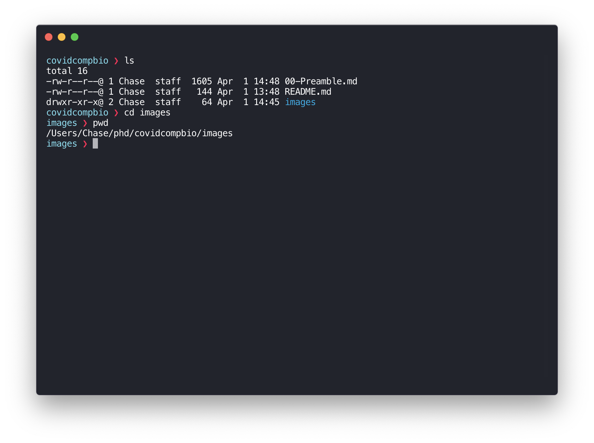

# Preamble - April 1, 2020

Hi everyone!  While you are beginning the linked courses on edX, we wanted to
introduce you to some of the concepts and utilities that you will need to get
you started in analyzing biological data.  Here, we'll introduce the **terminal**,
as well as programming languages like **Python**, and talk about how all these things
fit together for data analysis.  Mastering both the terminal and a programming
language like Python together will give you the power to ask and answer any
question that your data is capable of answering.

## What is the terminal?
Today, everyone interacts with their computer using a _graphical user interface_,
maneuvering through apps using a mouse or a trackpad to point and click.  For
example, when you scroll through a webpage or make a PowerPoint presentation,
you are engaging with the software graphically, clicking on links or dragging
figures around the screen.

However, another way to interact with the computer is through the _terminal_, or
_command line_.  Here's an example of what that looks like:

Through text commands, the terminal allows you to navigate your files, write code,
and run software, both on your computer and on external computing resources, like
HiPerGator.

## How can I get to the terminal?
This will depend on which operating system your computer is running:
  - **Windows:**
  - **Mac:** Macs are natively based on a UNIX computing environment, so this is far more straightforward.  Just open up the `Terminal` app from the Launchpad (may be tucked away in the "Other" category).  If you want to get fancy, feel free to install other terminal apps such as `iTerm2` or `hyper`, which offer some extra features like tabs and customization.

## What is a programming language?
Within the terminal, you'll be running software or executing code that you or others have written to perform some task, like aligning sequencing reads to the genome.  All software or code is written in a _programming language_, which is a set of words and rules that, when strung together, allow a human to write programs that computers can run.  There are many programming languages to choose from, such as C++, Java, R, and Python.

Programming languages can be divided up into essentially two types:
  1. **Compiled languages:** Code written in these languages (eg. C++, Java) is converted to machine code by the developers before it gets to the user.  These languages make code run more _efficiently_, but are often less human-readable and more complex to adapt to the particular needs of the user.  Much of the software that we use in sequencing analysis (eg. `HISAT2`) is written in these languages for efficiency.
  2. **Scripting languages:** Programs written in these languages (eg. Python, R) are executed by software called an "interpreter", which reads through the code as written and runs it line by line.  As such, these languages can be less efficient, but are often simpler to read and _more adaptable_ to new questions.  Programs written in these languages are called _scripts_.  In scientific data analysis, these languages are often used to make _pipelines_, which are scripts that feed raw data into a series of other programs automatically.

Also, although the grammar (_syntax_) can look very different between languages, many languages can be used to do the same things---each just has its own pro's and con's.

## Why are we using Python?
We chose to use Python in this course for the following reasons:
  1. **Popularity:** Python is routinely considered one of the most popular programming languages by developers across many fields, including computational biology.  Many of the tools most commonly used in image and sequencing analysis were designed either exclusively for Python, or at least with Python in mind.
  2. **Broad utility:** The core Python language contains many useful tools for manipulating data. In addition, many libraries have been developed to greatly extend the functionality of Python, making it one of the most broadly useful languages in existence. For example, `numpy` and `scipy` are really useful in scientific data analysis, and `matplotlib` is a popular library for making graphs. Since it is so broadly useful, a lot of the skills you'll learn in the context of computational biology can be applied to other fields as well.
  3. **Readability:** Many consider Python to be one of the least difficult programming languages to learn as a beginner, because its grammar was designed with simplicity and readability in mind.

Of course, other languages are useful as well (one example is R, which offers powerful statistical analysis), and many programmers will choose their programming language based on the task at hand.  However, we will be sticking to Python for this course, as it can be used for just about anything.

## How can we run Python code?
There are multiple ways for you to run Python code that you've written.  Most of the time, you'll be writing your code in a script file (a text file with a `.py` file extension) and running Python from the terminal. For example, to run a file called `myscript.py`, you would open the terminal, move to the folder containing the script, type
```bash
python script.py
```
and press Enter.  In this case, the Python interpreter would run through your whole script to the end, line by line, performing each command that you wrote in sequence.

Sometimes, rather than running an entire script, you might just want to run a couple of lines of code. For example, you might want to test out whether a line of code you wrote works as intended. For this, you can use a program called `IPython`, which allows you to test out lines of Python code in the terminal interactively.

The edX courses use software called Jupyter, which is built from `IPython`.  With Jupyter, you can write and execute short code blocks, add notes using `Markdown` blocks, and save the whole page into a notebook for easy access down the road.  Jupyter notebooks are very useful, both for teaching Python as well as for making easy-to-use, illustrative versions of pipelines to share with other researchers.
