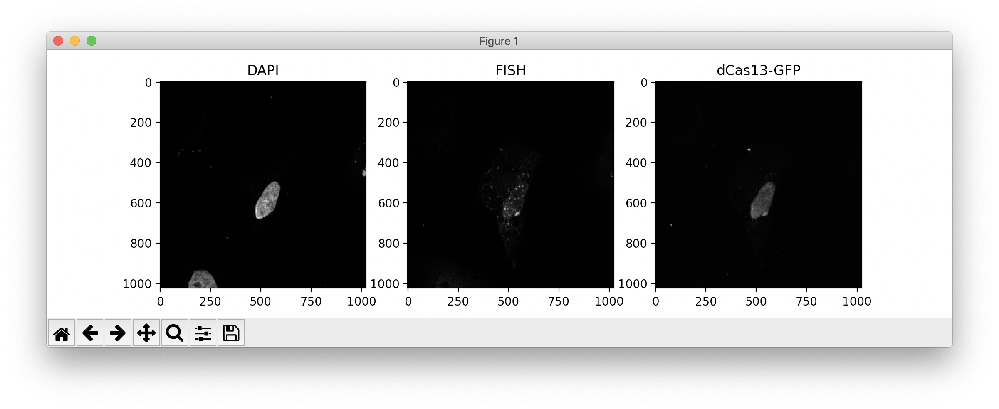
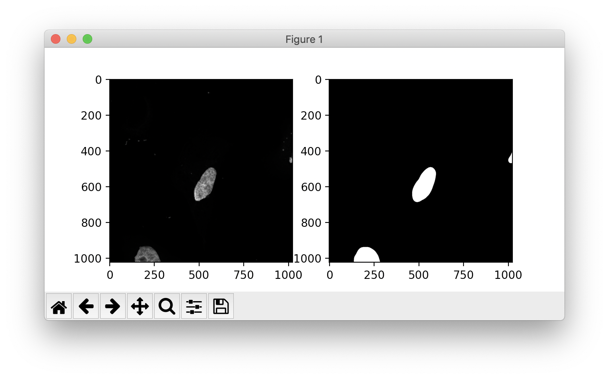
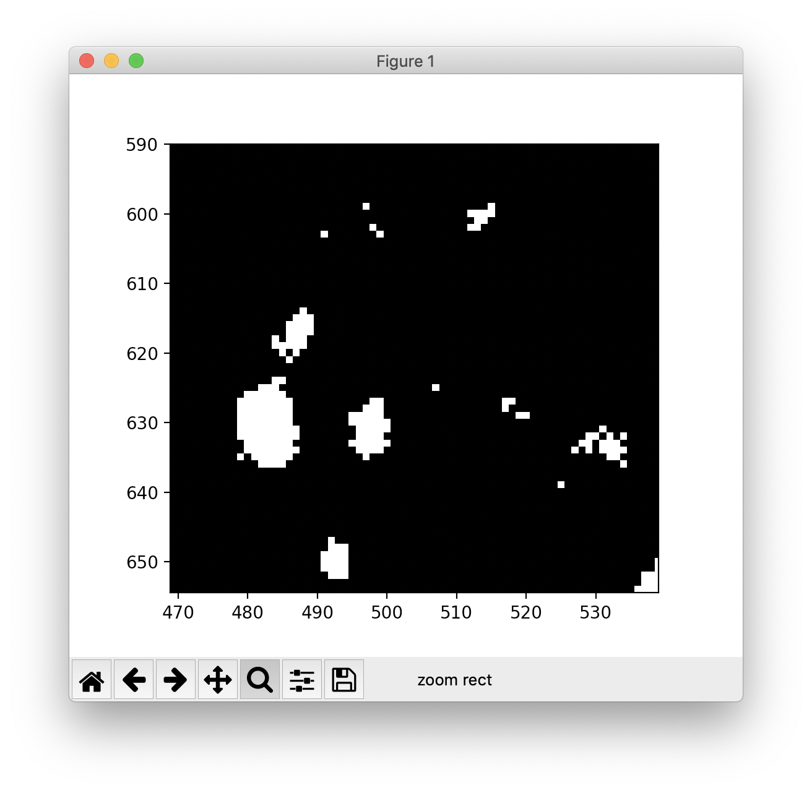

# Enrichment of RNA-binding proteins at RNA foci
Fundamentals Assignment \#5 -- Covid-19 Computational Biology Workshop -- October 4, 2020

### Background
Myotonic dystrophy type 1 (DM1) is caused by a CTG repeat expansion in the 3' UTR of the _DMPK_ gene. When transcribed, the long CUG repeat tract present in this RNA sequesters a crucial family of RNA-binding proteins called muscleblind-like protein (MBNL). These proteins normally play myriad roles in the nucleus and cytoplasm, including regulation of alternative splicing and RNA localization. When MBNL is sequestered, it can no longer perform these functions effectively, causing a broad spliceopathy that contributes greatly to the multisystemic syndrome associated with this disease. Further, these MBNL-CUG<sup>exp</sup> RNPs aggregate into nuclear foci which are not efficiently exported and remain trapped in the nucleus. Multiple therapeutic approaches in development for myotonic dystrophy focus on disrupting or degrading this toxic RNA.

To study the dynamics of these nuclear RNP foci and evaluate the effects of RBP binding on their stability, we are using Cas13, an RNA-targeting CRISPR effector. Cas13 locates its target RNA using a 22 nt complementary sequence on its guide RNA. In this experiment, we sought to evaluate if Cas13 can effectively bind the CUG<sup>exp</sup> RNA. We transfected into HeLa cells (1) a GFP-tagged deactivated Cas13 (dCas13, which can bind but not cleave RNA targets), (2) either a CUG-targeting or non-targeting guide RNA, and (3) a plasmid expressing 480 CTG repeats. We performed FISH to visualize the CUG<sup>exp</sup> RNA, and we used a confocal microscope to image the FISH and GFP channels for colocalization analysis.

### Assignment
In this assignment, we will create an image analysis pipeline to quantify the enrichment of dCas13-GFP signal within the nuclear foci detected by FISH, and we will apply it to a small number of images from this experiment. Our goals for this pipeline are to:

1. Open the image in Python and represent it as a NumPy array.
2. Identify all of the nuclei in the image.
3. For each nucleus, check if the cell was successfully transfected.
4. For successfully transfected cells, identify the positions of nuclear foci in the FISH channel, and compare the GFP intensity within the foci to the intensity in the background nucleoplasm.

To accomplish all of this, we will introduce a few very powerful external Python libraries for image analysis, including `numpy` and `scikit-image`.

The images for this assignment were captured on a Zeiss LSM 880 confocal microscope and are stored in the CZI file format. You can find these images on HiPerGator in the directory `/blue/ewang/cpkelley94/covidcompbio/assignment5_image_analysis`. There are two files in this directory:

1. **`targeting_gRNA.czi`**: an image from the CUG-targeting gRNA condition.
2. **`nontargeting_gRNA.czi`**: an image from the non-targeting gRNA condition.

Each file contains a 2D confocal image with the following channels:
- **channel 0:** MBNL immunofluorescence (not relevant to this assignment)
- **channel 1:** dCas13-GFP fluorescence
- **channel 2:** CUG<sup>exp</sup> RNA FISH
- **channel 3:** DAPI (nuclear stain)

We recommend that you download these images and complete this assignment on your local machine, as this makes it easiest to work with `matplotlib` figures during development.

Before starting this assignment, you may need to install a couple of packages. To install these dependencies, run the following command:

```bash
pip install scikit-image czifile
```

#### Steps
1. **Argument parsing.** If we want to write a pipeline that can be used to analyze many images, we don't want to hard-code the image path directly into the script. Instead, we can use `argparse` to read the image path as an argument in the command used to run the script.

    Start a Python script and name it `colocalize.py`. Import `argparse`. Define the argument `<image>` using the following lines:

    ```python
    parser = argparse.ArgumentParser()
    parser.add_argument('image', type=str, nargs=1, help='Path to .CZI image file.')
    ```

    This will instruct `argparse` to look for the image path as the first argument after the script path in the `python` command. We can store this path in our script as a variable:

    ```python
    args = vars(parser.parse_args())
    img_path = args['image'][0]
    ```

    Now, when the user runs the script, they are required to provide an image path. For example, if we want to analyze the image `targeting_gRNA.czi`, we would run the terminal command:

    ```bash
    python colocalize.py targeting_gRNA.czi
    ```

    This structure makes the code more flexible, allowing us to analyze any image in the dataset with the same script, without modification.

2. **Open the image.** When working with images in Python, it is common to represent them as NumPy arrays, which are very efficient N-dimensional array objects packed with useful methods for linear algebra. For more information on how to use NumPy array programming to improve the efficiency of Python, check out [this resource](https://realpython.com/numpy-array-programming/). To open our images, we will use the `czifile` library, which converts images in CZI format into NumPy arrays.

    Import the `CziFile` object from the `czifile` package, and import `numpy` as `np`. Open the image at `img_path` using the following:

    ```python
    with CziFile(img_path) as image_file:
        img_czi_format = image_file.asarray()
    ```

    The CZI image specification is a multi-dimensional format, where the data is organized by x-, y-, and z-position, as well as other axes including channel, timepoint, tile, and sample, when relevant. Since these are 2D images with 4 channels, we only need the axes for channel, x-, and y-position:

    ```python
    img = img_czi_format[0,0,:,0,0,:,:,0]  # new dimensions are (channel, x, y)
    ```

3. **Normalize the image.** Differences in incubation times during staining, probe hybridization efficiency, and imaging parameters can produce variance in overall brightness between images, even within the same experiment. To make our analysis pipeline resilient to these differences, we can normalize the intensities of the pixels in each channel to the highest intensity present in the image.

    Define a function called `normalize_image` that takes a single argument, a numpy array called `image`. Return a new numpy array where the intensity range of `image` is scaled from (`np.min(image)`, `np.max(image)`) to (0, 1). Use the interpolation function `np.interp()` to perform the scaling.

    Given the channel information provided in the problem statement, split up the DAPI, FISH, and dCas13-GFP channels into separate 2D arrays. Use your function to normalize the DAPI and FISH channels:

    ```python
    img_dapi = normalize_image(img[3,:,:])
    img_fish = normalize_image(img[2,:,:])
    img_dcas13 = img[1,:,:]
    ```

    (Notice how the `img` NumPy array is indexed. Each of its 3 dimensions is sliced independently, with indexes separated by commas. The first dimension is the _color channel_ (DAPI, FISH, or dCas13-GFP), and the second and third dimensions are _x_- and _y_-position. By splitting up `img` into its separate color channels, we are creating three new 2D arrays.)

4. **Visualize the image.** We can use `matplotlib` to display these three separate channels. Import `pyplot` as `plt` from the `matplotlib` library. Create a figure with three subplots using `plt.subplots()`, and use `imshow` to draw a channel into each subplot:

    ```python
    fig, ax = plt.subplots(1,3)
    ax[0].imshow(img_dapi, cmap='binary_r')
    ax[0].set_title('DAPI')
    ax[1].imshow(img_fish, cmap='binary_r')
    ax[1].set_title('FISH')
    ax[2].imshow(img_dcas13, cmap='binary_r')
    ax[2].set_title('dCas13-GFP')
    plt.show()
    plt.close()
    ```

    The `cmap` keyword argument tells `matplotlib` which colormap should be used when displaying the image. `'binary_r'` is a greyscale colormap, where low values map to black and high values to white. If you would like to use a different colormap when showing an image, check out this [reference sheet](https://matplotlib.org/3.1.1/gallery/color/colormap_reference.html).

    If you run this script on `nontargeting_gRNA.czi`, you should see something like this:

    

5. **Segment the nuclei.** Now that we have the image loaded and normalized, we can start working through the analysis. The first step is to identify the cell nuclei in the DAPI channel. To do this, we can choose a **threshold** intensity value; we can then classify all pixels brighter than this threshold as "nucleus" and all other pixels as "not nucleus". If we represent the "nucleus" category as the boolean `True` and "not nucleus" as `False`, this leaves us with a _boolean mask_ array with the same dimensions as the image, but filled with `True`'s and `False`'s.

    To accomplish this, we will use some functions from `scikit-image`, a powerful library for image analysis in Python. Import the `filters` module from `skimage`. Before thresholding, we should smooth out any noise in the image using a Gaussian blur filter:

    ```python
    img_dapi_blurxy = filters.gaussian(img_dapi, (10, 10))
    ```

    Next, we can use an automatic threshold detection algorithm to determine the optimal threshold. In this pipeline, we will use [Otsu's method](https://en.wikipedia.org/wiki/Otsu%27s_method) (with a minor adjustment) to do this automatic thresholding:

    ```python
    thresh_dapi = filters.threshold_otsu(img_dapi_blurxy)*0.85
    ```

    To create a boolean array that is `True` for positions in `img_dapi_blurxy` that are above the threshold and `False` everywhere else, we can use a convenient NumPy trick:

    ```python
    mask_dapi = (img_dapi_blurxy > thresh_dapi)
    ```

    We have now identified the positions and extents of all the nuclei in the image. To check out how our segmentation looks, make another `matplotlib` figure with 2 subplots, and use `imshow` to display the DAPI image next to our segmentation mask `mask_dapi`. This should look something like this:

    

    If you look closely, you'll notice that the nuclei in our mask look a bit bigger than they do in the parent image. For some analyses, this may not be an issue; however, for this pipeline, since we will be measuring background GFP fluorescence in the nucleus, we want to make sure that the mask doesn't extend outside the true extent of the nucleus. One fix we can implement is to shrink the nuclei in the mask by a few pixels. Import the `morphology` module from `skimage`, and run the `binary_erosion()` function 10 times to shave 10 pixels off the mask:

    ```python
    for i in range(10):
        mask_dapi = morphology.binary_erosion(mask_dapi)
    ```

6. **Segment the RNA foci.** Next, we will need to identify the CUG<sup>exp</sup> RNA nuclear foci from the FISH image. Rather than using an automatic thresholding algorithm, we have determined empirically that a threshold value of `0.3` produces optimal segmentation of foci from background in this experiment. Create a boolean array named `mask_fish` that is `True` for all pixels in `img_fish` greater than `0.3`, and `False` everywhere else. To check out this segmentation, make a new `matplotlib` figure that displays `mask_fish` next to the parent FISH image.

    This threshold looks decent. However, if we zoom in to look at individual pixels, we see some noise artifacts, where a few individual pixels are coming up `True` and some foci contain a couple holes of `False` pixels:

    

    We can address this with a pair of `skimage` functions that remove small blocks of `True` or `False` pixels below a threshold size:

    ```python
    mask_fish = morphology.remove_small_objects(mask_fish, min_size=8)
    mask_fish = morphology.remove_small_holes(mask_fish, area_threshold=8)
    ```

    Use `matplotlib` to observe the effects of these functions on `mask_fish`.

7. **Identify transfected nuclei.** In a transient transfection experiment, not all nuclei will be transfected. Since we have strong dCas13-GFP expression in the nucleus, we can use this to identify which nuclei in the image contain the transgenes.

    First, we need to label the contiguous blocks of `True` pixels in `mask_dapi` as different nuclei. Fortunately, `skimage` has a very convenient function for this:

    ```python
    labeled_mask_dapi, n_nuc = morphology.label(mask_dapi, return_num=True)
    ```

    This creates a new array `labeled_mask_dapi` where each nucleus is labeled with a different integer, from 1 to `n_nuc`, and the background is labeled as 0. Now, we can loop over all the nuclei in the image and test if each nucleus is GFP-positive.

    Loop over all the nucleus labels from 1 through `n_nuc` (hint: use `range()`, and think carefully about the start and stop positions). Within this loop, create a new boolean mask called `this_nucleus` that is `True` for all pixels in the nucleus corresponding to the current label. Next, we will test whether the mean GFP signal in the `True` region of `this_nucleus` is sufficiently higher than background:

    ```python
    if np.mean(img_dcas13[this_nucleus]) > 1.25*np.mean(img_dcas13):
    ```

    We are doing a couple new things here. First, we are using the `np.mean()` function to calculate the mean value of an array. We are also using another fancy NumPy trick: we index `img_dcas13` using the boolean array `this_nucleus`. This tells `np.mean()` to consider _only the pixels in `img_dcas13` within the current nucleus_ (i.e., pixels that are True in `this_nucleus`). This is a very convenient indexing method offered by NumPy that saves multiple lines of code, and it becomes very intuitive after working with NumPy arrays for a while.

    To check if this filter accurately selects GFP-positive nuclei, create a new `matplotlib` figure within the `if` conditional that displays `this_nucleus` next to the GFP image.

8. **Calculate GFP enrichment.** Now we are ready to determine the enrichment of dCas13-GFP in the nuclear foci relative to the background nucleoplasm. Within your `if` conditional, create two new boolean masks, one that is `True` for all pixels in the current nucleus AND in foci, and one that is `True` for all pixels in the current nucleus AND NOT in foci:

    ```python
    mask_foci = np.logical_and(mask_fish, this_nucleus)
    mask_not_foci = np.logical_and(np.logical_not(mask_fish), this_nucleus)
    ```

    Here, we are using logic gate functions provided by NumPy to perform the AND and NOT operations. Use `matplotlib` and `imshow` to see what these masks look like.

    Next, use `np.mean()` to calculate the mean GFP signal in both of these regions (hint: use the same mask indexing trick we used above). To calculate the enrichment ratio, divide the mean GFP signal within foci by the signal outside the foci. Print this enrichment ratio to the terminal.

9. **Test the pipeline.** Our pipeline is complete! Run the pipeline on the two provided images. In each image, only one GFP-positive nucleus should be present. Is the dCas13 enrichment in the CUG-targeting gRNA condition higher than the non-targeting condition?

In this assignment, we only analyze two images--- however, the real power of using Python for image processing is the ability to analyze many images rapidly and automatically. By looping through all images within a directory and outputting per-cell calculations to a file, you can process hundreds of microscopy images in minutes. This assignment is only a brief introduction to what Python image processing is capable of: check out the documentation for [scikit-image](https://scikit-image.org/) and [scipy.ndimage](https://docs.scipy.org/doc/scipy/reference/ndimage.html) to learn more!
